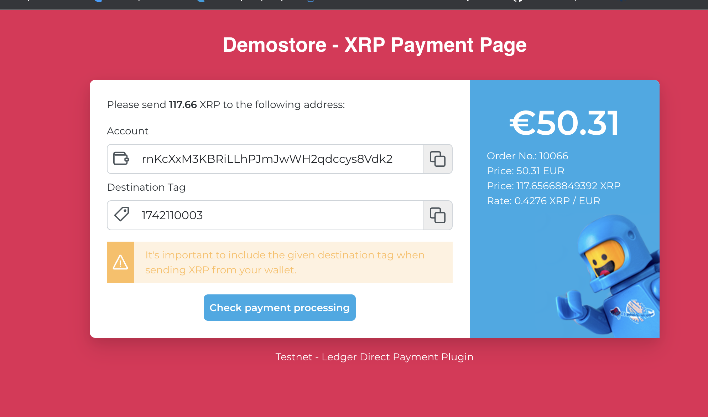

# LedgerDirect - Magento2/VueStorefont2



## An integration of the [XRPL](https://xrpl.org/) for [Magento2/VueStorefront2](https://docs.vuestorefront.io/magento/) 


## Installation

1. Copy the `LedgerDirect` folder into the `modules` folder of your VueStorefront Noxt project.

2. Register the module in`nuxt.config.js`in the `modules`section:

```javascript
    modules: [
      '~/modules/catalog',
      '~/modules/customer',
      '~/modules/wishlist',
      '~/modules/checkout',
      '~/modules/review',
      '~/modules/LedgerDirect',
    ]
```

3. Add the following extension to the magento integration in `middleware.config.js`:
```javascript
  integrations: {
    magento: {
    	// Paste this after the standard configuraton:
    	extensions: (extensions) => [
        ...extensions,
        {
          name: 'ledger-direct-api',
          extendApiMethods: {
            xrpPayment: async (context, params) => {
              const { orderNumber } = params;
              const url = `${process.env.VSF_MAGENTO_BASE_URL}/rest/V1/ledger-direct/payment/xrp-payment/${orderNumber}`;
              const response = await fetch(url);

              return await response.json();
            }
          },
        },
      ]
    },
  }
```


## License

The MIT License (MIT). Please see [License File](LICENSE) for more information.
